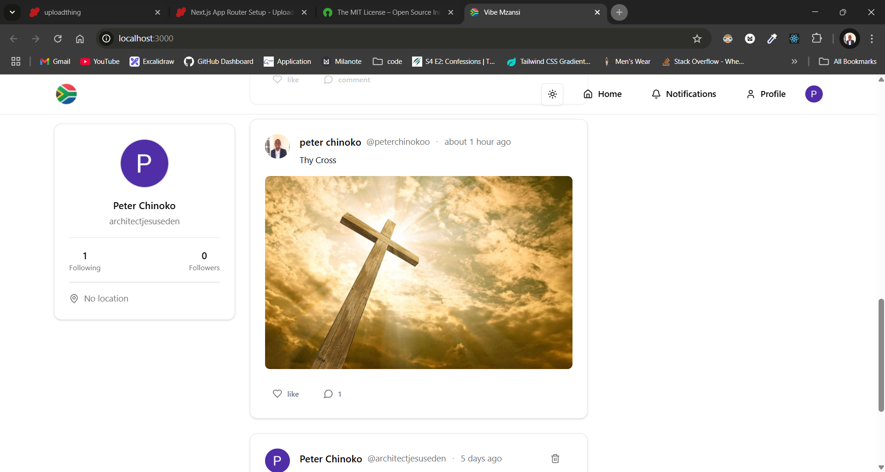

# Vibe Mzansi

- This is a Next.js application that allows users to create and share posts, follow other users, and engage with their content.

## Features

- User authentication using Clerk
- Post creation and sharing
- User profiles and following
- Image upload and sharing
- Real-time updates using Next.js

## Getting Started

- To get started with this project, follow these steps:

1. Clone the repository: git clone ` https://github.com/Chinokoo/vibe-mzansi.git`

2. Install dependencies: `npm install or yarn install`

3. Start the development server: `npm run dev or yarn dev`
4. Open your browser and navigate to `http://localhost:3000`

## Project Structure

The project is organized into the following directories:

- src: contains the source code for the application
- src/components: contains reusable React components
- src/lib: contains utility functions and libraries
- src/pages: contains page-level components
- public: contains static assets and files

## Technology Stack

- Next.js: for building the application
- React: for building reusable UI components
- Clerk: for user authentication
- Tailwind CSS: for styling and layout
- Uploadthing: for image upload and sharing

## Contributing

Contributions are welcome! If you'd like to contribute to this project, please follow these steps:

- Fork the repository: git fork https://github.com/your-username/nextjs-social-media-app.git
- Create a new branch: git branch feature/new-feature
  Make changes and commit them: `git commit -m "Add new feature"`
- Push changes to your fork: git push origin feature/new-feature
- Open a pull request: https://github.com/your-username/nextjs-social-media-app/pulls

## License

- This project is licensed under the MIT License. See [License](https://opensource.org/license/mit) for details.

## Acknowledgments

This project was built using the following open-source libraries and tools:

- Next.js
- React
- Clerk
- Tailwind CSS
- Uploadthing

Thanks to the maintainers and contributors of these projects for their hard work and dedication!
